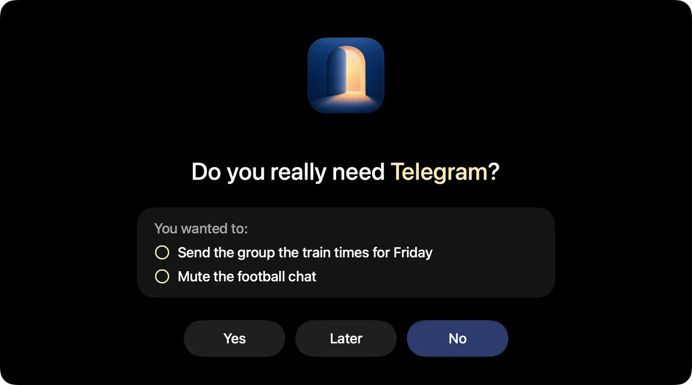
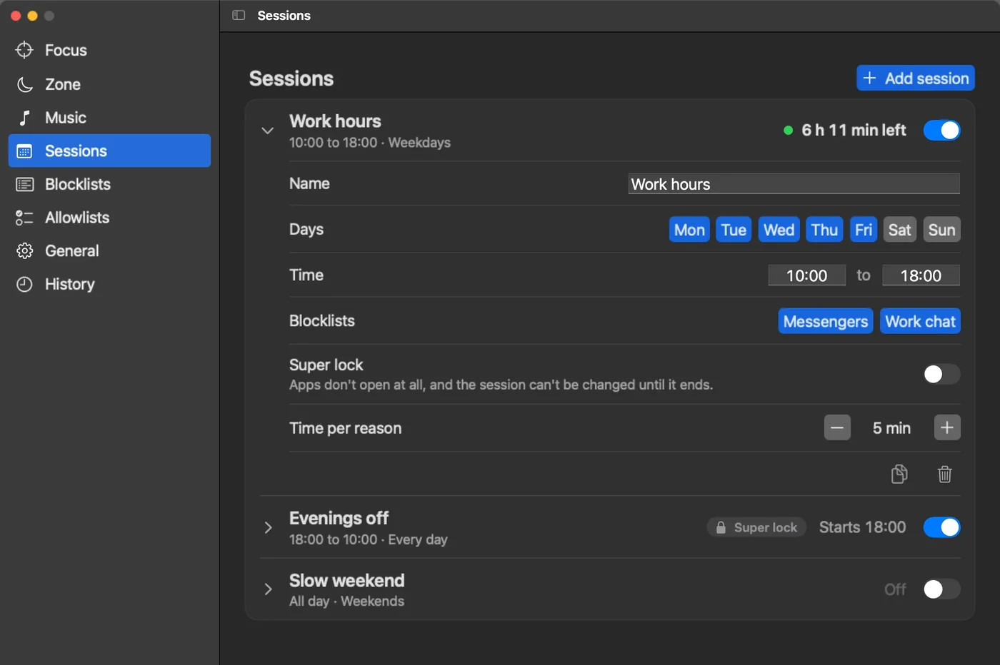

# Doorway Desktop

A small Mac app that asks you to type a reason before it lets you open a distracting app. It's the desktop half of Doorway, next to the [Doorway extension](https://github.com/Pawel-Kica/doorway-extension) for Chrome.

I built it for myself, omakase style, so it works the way I like it. Fork it and make it yours, or open an issue if you'd like something changed.



## What it does

You make blocklists of apps (Signal, WhatsApp, Slack, whatever pulls you in) and sessions that say when those lists count, like weekdays 10:00 to 18:00. During a session, opening a blocked app hides it and asks why you want it. Type at least 10 words and it opens for a few minutes. When the time is up, it asks again. Never mind closes the app.

- **Quick sessions.** Block a list right now, for 30 minutes to 4 hours.
- **Super lock.** The apps don't open at all, and you can't turn the session off until it ends.
- **Focus.** Pick an allowlist, and for 25 minutes to 4 hours every other app gets hidden the moment it shows up. Nothing gets quit, so your work stays where you left it.
- **Zone.** A plain black screen that just says Focus, for a second display.
- **Music.** A built-in lofi mix plus your own audio files, with the play/pause key.
- **History.** Every reason you typed, with a few charts. It all lives in `~/Library/Application Support/DoorwayDesktop/reasons.jsonl`, nothing leaves your Mac.

It gates desktop apps only. For websites there's the [Doorway extension](https://github.com/Pawel-Kica/doorway-extension).



## Install

You need macOS 14 or newer and a recent Xcode. I build it with Xcode 27, anything with Swift 5.10 or newer should do.

```sh
git clone https://github.com/Pawel-Kica/doorway-desktop.git
cd doorway-desktop
./build.sh
open "/Applications/Doorway Desktop.app"
```

`build.sh` builds a release binary and puts `Doorway Desktop.app` in `/Applications`, so Spotlight and Raycast find it. Run it again to update. If Doorway Desktop is already running, it keeps the old build until you quit and reopen it.

The app is signed ad hoc, not by an Apple Developer account. An app you build yourself usually opens fine, but if macOS refuses (it will for a copy someone sent you), open System Settings > Privacy & Security, scroll down and click Open Anyway. You only do this once. If your keychain has an Apple Development certificate, `build.sh` signs with it instead.

On first launch it adds itself as a login item, so it starts with your Mac. You can remove it in System Settings > General > Login Items.

Hiding apps needs no permissions. The one it can ask for is Accessibility, and only if you turn on Stop Dock clicks in the Focus tab. That stops a click on the Dock icon of an app Focus keeps out. Without it, Focus still hides the app right after it opens. With ad hoc signing the grant can drop after a rebuild, since macOS ties it to the signature. Turn it off and on again in System Settings > Privacy & Security > Accessibility.

Run the tests with `swift test`.

## iPhone

There's an early iPhone version in `ios/`. iOS doesn't let a free app block other apps, so it goes through Shortcuts: you make one personal automation per app (App > Is Opened > Run Immediately) that runs Doorway's Gate App action. The first few opens a day take a short reason, after that a long one. The gated app shows for a moment before the prompt covers it. There's no way around that.

It needs Xcode 27 and iOS 26. To run it on your phone:

1. Create `ios/Local.xcconfig` with your team ID (Xcode > Settings > Accounts) and your own bundle ID prefix:
   ```
   DEVELOPMENT_TEAM = ABCDE12345
   BUNDLE_ID_PREFIX = com.yourname
   ```
2. Open `ios/Doorway.xcodeproj` and run it on your phone. The app shows the Shortcuts setup steps.

With a free Apple account the app expires after 7 days, then you run it from Xcode again. The logic has its own tests: `cd ios && swift test`. The Xcode project comes from `ios/project.yml` via [XcodeGen](https://github.com/yonaskolb/XcodeGen), so after editing that file, run `xcodegen` in `ios/`.

## More

The landing page: [pawelkica.com/doorway-desktop](https://pawelkica.com/doorway-desktop).

MIT licensed, see [LICENSE](LICENSE).
